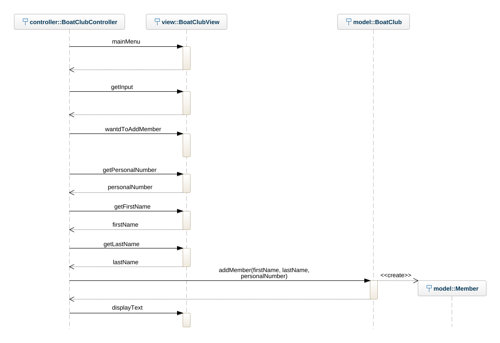

# Boatclub OO-Design
This document describes the design according to the requirements presented in assignment 2.

## Architectural Overview
The application uses the model-view-controller (MVC) architectural pattern. The view is passive and gets called from the controller. The view may only read information from the model, not directly change it.

## CLASS DIAGRAM WITH ALL OPERATIONS AND ATTRIBUTES

*All classes and methods are added due to the instructions "The class diagram should correspond exactly to the final implementation."*
One might say that the view includes a lot of methods and should be split up into several classes. But, most of the methods are very small, only one line of code, and because they require the userInput from the Scanner, it is not as easy to just add them to a seperate class. It is possible to add them into a use case method instead, but this is how I decided to do it for this time, I'd like to think that the view class sill got pretty high cohesion.

## SEQUENCE DIAGRAM OF ADDING A BOAT

## SEQUENCE DIAGRAM OF ADDING MEMBER
